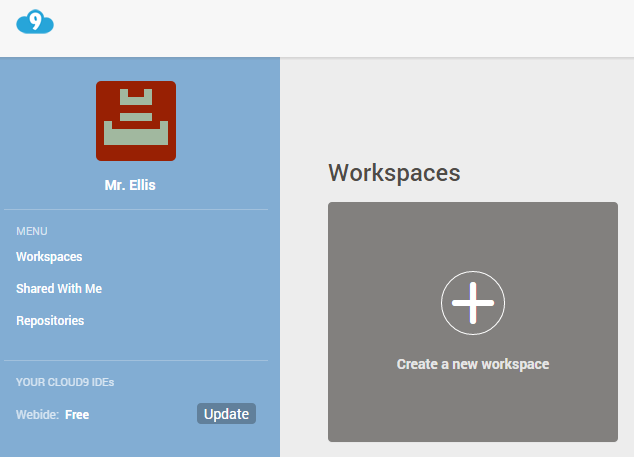
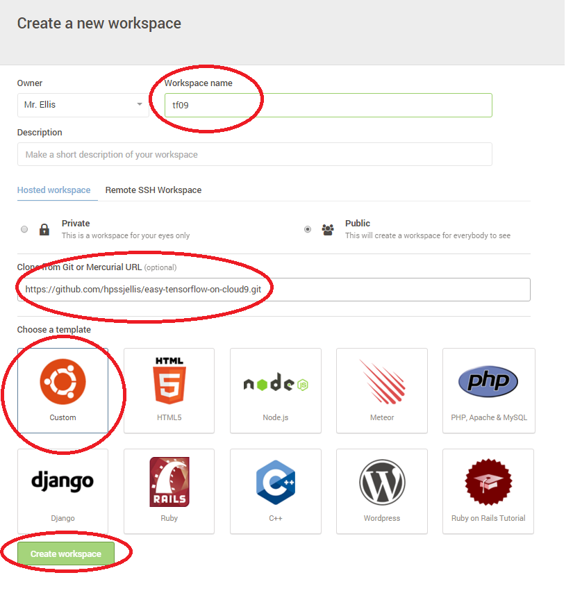
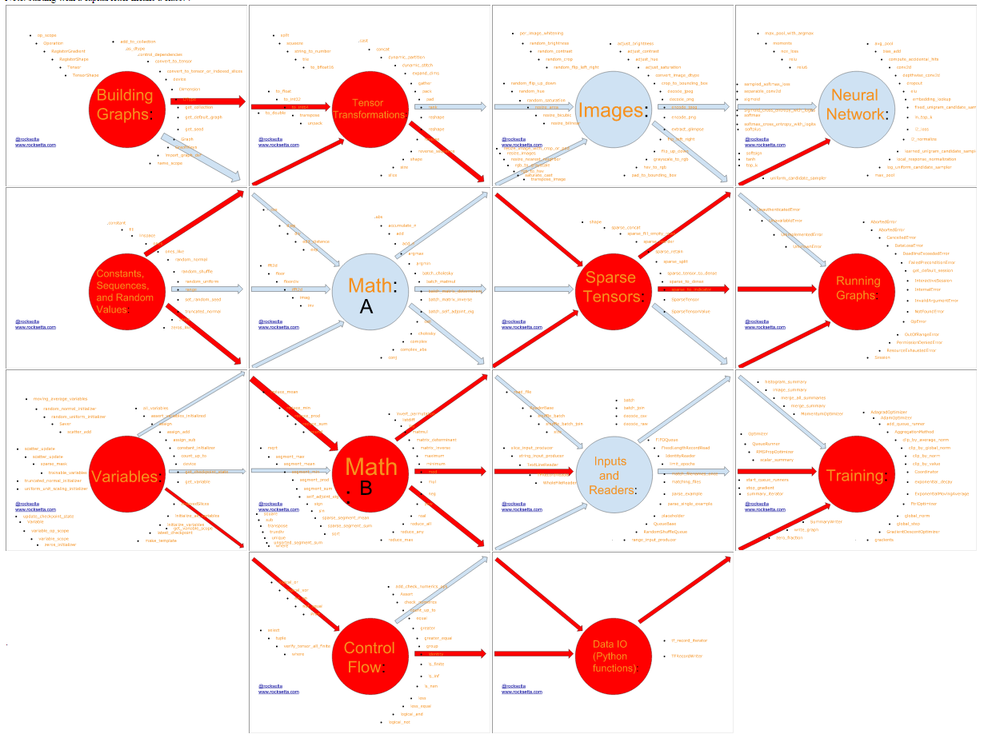

# easy-tensorflow-on-cloud9
Hopefully the easiest way to get started with Google's TensorFlow Deep Learning Neural Network Python Library


Feb 7, 2016 Updated after the video

Added bash file setup-new02.sh which automates setting up ipython notebook (now called jupyter).


.

.

.

Step by step youtube vide at 

https://youtu.be/kMtrOIPLpR0


and my TensorFlow Teacher webpagge is at

http://rocksetta.com/tensorflow-teacher/


install onto cloud9 http://c9.io as a custom workspace

Using the url for this repository 

https://github.com/hpssjellis/easy-tensorflow-on-cloud9.git


In the terminal type:
``` bash
bash setup.sh
```

OR JUST RIGHT CLICK AND SELECT RUN ON THE FILE setup.sh 

Note: Any of these examples can be run by just right clicking on the files and selecting run.

All files with the file name starting with rocksetta and ending with .sh should be able to be run this way.


If you have never used cloud9 it may look hard but compared to making your own linux server, cloud 9 is a breeze:

1. register for a free account
1. click on the big plus sign to make a new workspace




1. Fill out the forms as needed, the main fields are the URL for this repository (make sure it has .git at the end
https://github.com/hpssjellis/easy-tensorflow-on-cloud9.git) 

1. Make sure the default custom box is selected



1. Then just right click and run setup.sh and take a break for about 10 minutes


.

.

.


Then hopefully try some examples in the rocksetta-example folder 

My TensorFlow API diagram is at http://rocksetta.com/tensorflow-teacher/tensorflow-svg.html which is a clickable version of



My Tensorflow-teacher site is at http://rocksetta.com/tensorflow-teacher/


Other peoples examples are in the other folders. 

A good starting point is the try-tf folder explained at this website

https://bcomposes.wordpress.com/2015/11/26/simple-end-to-end-tensorflow-examples/


By Jeremy Ellis Maker of rocksetta.com 

twitter @rocksetta


Side note:


using 

``` bash
source ~/virtual-tf/bin/activate
```

sets up the environment

note just type 

``` bash
deactivate
```

to get your cursor back

I include this code in each of my .sh files but you could run the code in the command line and call the files normally.


to find tensorflow


cd /usr/local/lib/python2.7/site-packages/tensorflow


